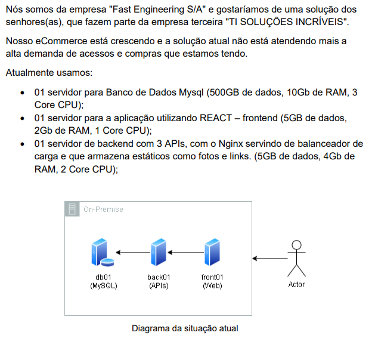

# Documentação do eCommerce local para a AWS, empresa "Fast Engineering S/A"

# Etapa 1: Replicação e Migração

Com o diagrama de migração, podemos ver como foi feito o processo de migração do eCommerce, saindo de uma estrutura local (on-premise) para uma estrutura em nuvem na AWS. 

## 1. Estrutura On-Premise

Servidores Locais:

• Front01 (Web): Servidor responsável pelo frontend do eCommerce.

• Back01 (API): Servidor que gerencia as APIs do sistema.

• DB01 (MySQL): Banco de dados que armazena todas as informações do eCommerce.

## 2. Processo de Migração

• AWS Replication Agent:

Instalado nos servidores locais, permite conectá-los aos Replication Servers na AWS;
Responsável por capturar e replicar os dados do ambiente on-premise para o ambiente AWS;
O AWS Replication Agent captura continuamente as alterações nos servidores locais, transmitindo para os Replication Servers provisionados pelo MGN. Isso garante que o ambiente migrado esteja sempre em sincronia com o ambiente on-premise, até o momento do corte definitivo.

Serviços Utilizados na Transferência:

• MGN (AWS Application Migration Service):

Atua no processo de migração e replicação dos servidores para a nuvem;
Garante que os recursos sejam transportados de forma eficiente e sem interrupções.

• DMS (Database Migration Service):

Realiza a migração dos dados do banco de dados MySQL para o ambiente AWS;
Garante a integridade e a segurança dos dados durante a transição.

## 3. Arquitetura na AWS

• VPC (Virtual Private Cloud):

Os recursos migrados são organizados dentro de uma VPC, garantindo isolamento e segurança.

• Subnets:

**Public Subnet (Replication Servers)**:

Contém os servidores de replicação que processam os dados recebidos do ambiente on-premise.

**Public Subnet (App Server)**:

Hospeda o servidor de aplicação pós-migração.
Utiliza volumes EBS para armazenamento.

**Private Subnet (RDS)**:

Banco de dados relacional migrado é hospedado em um ambiente privado, utilizando o Amazon RDS.

## 4. Fluxo de Dados

• Os servidores locais (Front01, Back01 e DB01) são conectados aos Replication Servers na AWS por meio do AWS Replication Agent.

• Os dados capturados pelo agente são replicados para os Replication Servers dentro da Public Subnet;

• A comunicação entre o ambiente on-premise e os Replication Servers é realizada por meio da porta TCP 443, enquanto os dados replicados utilizam a porta TCP 1500 para serem processados na AWS.

Após a replicação:

• Os servidores de aplicação são provisionados em instâncias EC2 T3 na Public Subnet.

• O banco de dados MySQL é migrado para o Amazon RDS na Private Subnet.

# Perguntas etapa 1:

## Quais as ferramentas vão ser utilizadas?
AWS MGN (Application Migration Service);
AWS Database Migration Service (DMS);
Amazon S3;
AWS VPC;

## Como será realizado o processo de Backup?
Para o banco de dados será utilizado os backups automáticos do Amazon RDS. 
Para os demais servidores, contaremos com o uso do Amazon EBS.

## Qual o custo da infraestrutura na AWS (AWS Calculator)? --

# Etapa 2: Modernização

## Documentação da Arquitetura AWS e Amazon EKS

A partir desse momento, vamos descrever a arquitetura apresentada no diagrama de modernização, detalhando os principais componentes e o fluxo de trabalho.

## Visão Geral

A arquitetura apresentada utiliza o Amazon Web Services (AWS) para hospedar e gerenciar aplicações em contêineres por meio do Amazon Elastic Kubernetes Service (EKS). Ela é projetada para alta disponibilidade, segurança e escalabilidade. Os principais componentes incluem:

• Amazon EKS para gerenciamento de contêineres.

• Amazon RDS para banco de dados gerenciado.

• Balanceadores de carga (NLB e ALB) para distribuição de tráfego.

• Amazon S3 e EFS para armazenamento.

• AWS Secrets Manager para gerenciamento de credenciais.

## Componentes da Arquitetura

1. Camada de Segurança

• AWS Secrets Manager: Armazena e gerencia segredos, como credenciais do banco de dados, de forma segura.

2. Região e Zonas de Disponibilidade

• A arquitetura está distribuída em duas Zonas de Disponibilidade, garantindo alta disponibilidade;

• Dentro de cada zona, existem sub-redes privadas que contêm os dados confidencias.

3. Rede

• As subnets públicas hospedam o NAT Gateway e os balanceadores de carga (NLB e ALB), enquanto as subnets privadas hospedam os nós de contêineres do Amazon EKS e o banco de dados Amazon RDS, garantindo que os serviços voltados para o público fiquem acessíveis, enquanto os dados confidenciais permanecem protegidos;

• VPC (Virtual Private Cloud): Proporciona isolamento da rede;

• NAT Gateway: Permite que recursos em sub-redes privadas acessem a internet de forma segura;

• Internet Gateway: Fornece conexão entre a VPC e a internet.

4. Balanceamento de Carga

• Network Load Balancer (NLB): Garante baixo tempo de resposta e gerencia conexões de rede em nível TCP;

• Application Load Balancer (ALB): Distribui tráfego HTTP e HTTPS para os contêineres do EKS, suportando escalabilidade automática.

5. Amazon EKS (Elastic Kubernetes Service)

• Hospeda os contêineres das aplicações;

• Configurado com Auto Scaling para ajustar a capacidade com base na demanda;

• Implanta contêineres em sub-redes privadas para maior segurança.

6. Banco de Dados

• Amazon RDS: Um banco de dados gerenciado usado para armazenar dados de aplicações;

• Configuração de alta disponibilidade com uma instância alternativa para failover.

7. Armazenamento

• Amazon S3: Usado para armazenamento de objetos, como arquivos de backup e dados estáticos;

• Amazon EFS: Sistema de arquivos compartilhado entre os contêineres.

8. Usuário Final

• Os usuários acessam os serviços por meio do Route 53, que direciona o tráfego para o Network Load Balancer (NLB).

# Perguntas etapa 2:

## Quais as ferramentas vão ser utilizadas?
Kubernetes e Amazon EKS;
AWS load Balancer;
RDS;
IAM;
Route 53;
EFS;
Amazon S3.

## Como serão garantidos os requisitos de Segurança?
Utilização de subsnets pública para servidores de acesso e subnets privados para o banco de dados;
Configuração de security groups restringindo o tráfego para portas 443 e 1500;
Criptografia em volumes EBS e S3.

## Qual o custo da infraestrutura na AWS (AWS Calculator)? --
